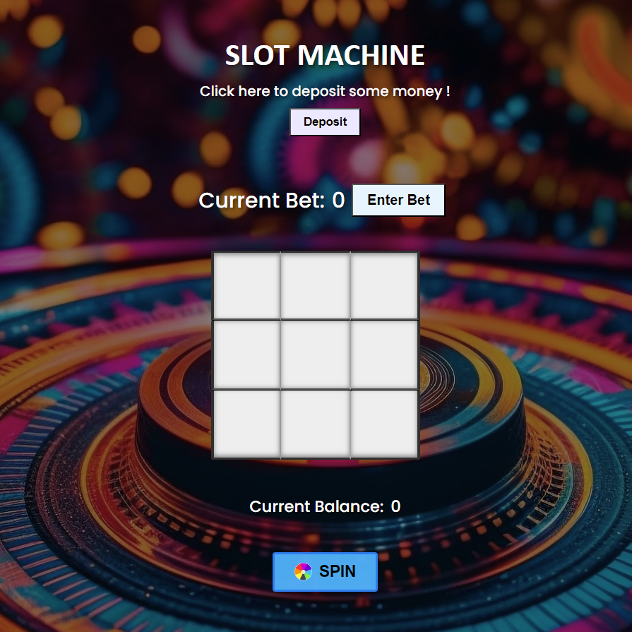
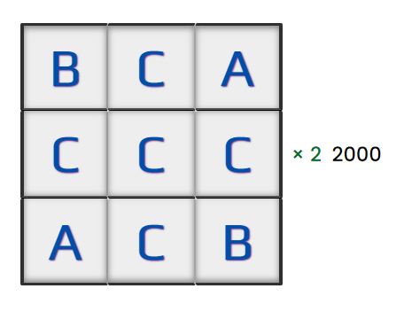

<div id="top"></div>

# Slot-Machine
A basic slot machine game in plain html, css, javascript
## How to play ?
#### [Play Here](https://eternoseeker.github.io/Slot-Machine/)

1. Deposit an amount by entering a number
2. Enter value for the bet ( bet will be placed on every line )
3. Click the SPIN button to spin the slot machine
- If the letters on any line match, the bet amount multiplied by respective multiplier of the letter gets added to the current balance
- A × 8; B × 4; C × 2;

## Screenshots
**Initially:** 



Winning on "C":




## Contributing
### Steps to contribute:

- Fork the repository by clicking the "Fork" button in the upper right corner of this page.
- Clone repository to your local machine:
```
git clone https://github.com/EternoSeeker/Slot-Machine.git
```
- Create a new branch for your contribution:
```
git checkout -b your-branch-name
```
- Test your changes locally to ensure they function correctly.
- Commit your changes with commit messages which contains description:
```
git commit -m "commit message"
```
- Push your changes to your forked repository:
```
git push origin your-branch-name
```
- Open a pull request to the main branch of this repository.

If you find any bugs or have any suggestions, please open an issue on GitHub and provide detailed information about the bug or suggestion.
Visit the issues section to work on existing issues or create your own and work on it.

Give a ⭐ if you enjoyed contributing to this repository !

<p align="right">(<a href="#top">🔼 Back to top</a>)</p>
